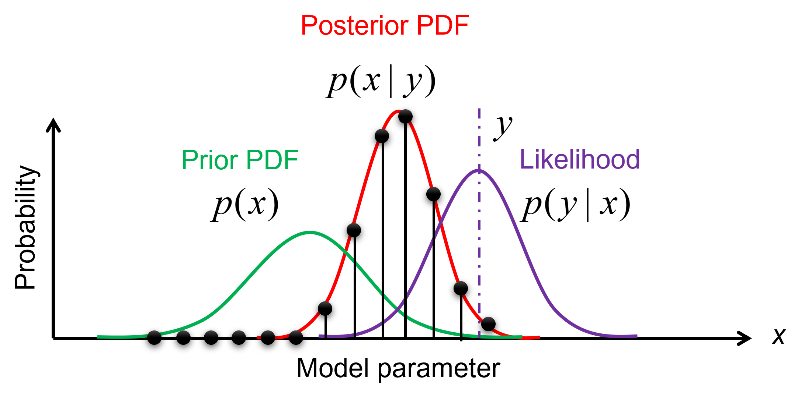
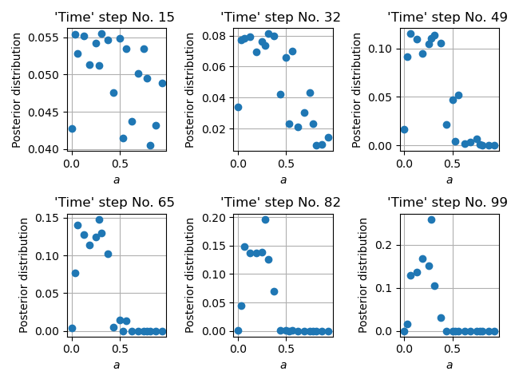
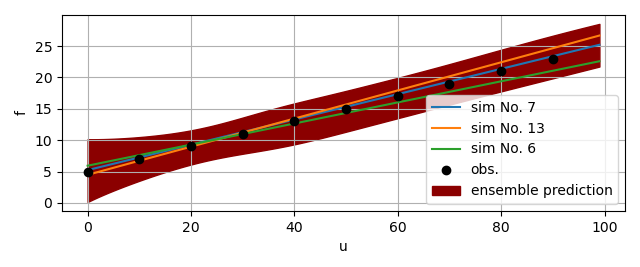
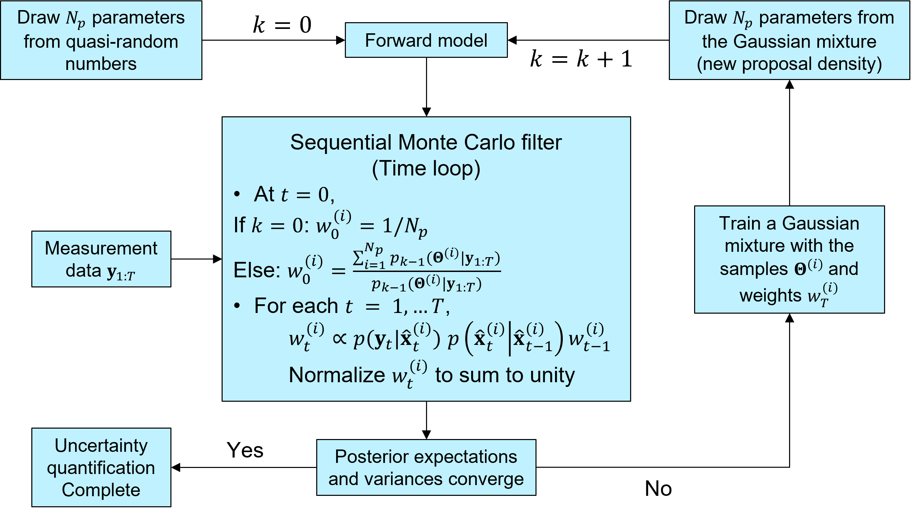
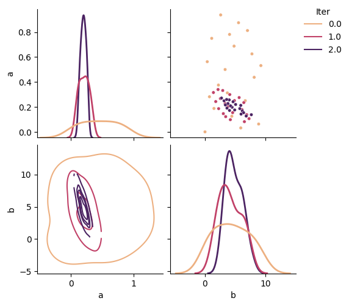

.. _BayesianCalibration:


Bayesian Calibration using GrainLearning
########################################

Bayesian calibration is a probabilistic method for estimating the parameters of a computer model.
The output of Bayesian Calibration are conditional probability distributions of model parameters **conditioned on**
(experimental or theoretical) reference data. Here, we will apply Bayesian calibration to DEM models of granular materials,
using the GrainLearning package. Check out the `GrainLearning documentation <https://grainlearning.readthedocs.io/en/latest/>`_ for more information.
Essentially, what a Yade user needs to do is to define a *callback function* that runs their Yade script
, e.g., in batch mode, with a parameter table given by GrainLearning.
GrainLearning updates this table iteratively, based on the provided reference data, until the error tolerance is met.

Installation
------------

Stable versions of GrainLearning can be installed via `pip install grainlearning`.
However, you would still need to clone the GrainLearning repository to run the tutorials.

.. code-block:: bash

   # create a virtual environment
   python3 -m venv env
   source env/bin/activate

   # install GrainLearning
   pip install grainlearning[visuals]

   # Clone the repository (optional)
   git clone https://github.com/GrainLearning/grainLearning.git

   # run a simple linear regression test (optional)
   python3 grainLearning/tutorials/simple_regression/linear_regression/python_linear_regression_solve.py

   # deactivate virtual environment (optional)
   deactivate
   rm -r env

Alternatively, you can include other optional modules of GrainLearning by passing the corresponding extras to `pip install`,
such as `pip install grainlearning[dev]` or `pip install grainlearning[rnn]` or simply `pip install grainlearning[all]`.

Background
==========

In Bayesian filtering (updating the probability distribution of a model state given data sequences), deterministic models
are made stochastic by adding unknown modeling and observation errors. We typically refer to the systems that these stochastic models
describe as **dynamic systems**. The **state** of a dynamic system is the set of random variables that describe the system at a given time.

Dynamic Systems
---------------

The `dynamic_systems` module of GrainLearning encapsulates simulation and reference data in a single `DynamicSystem` class.
The `IODynamicSystem` class sends instructions to external *third-party software* like Yade and retrieves simulation data
from the output files of the software.

.. note:: A dynamic system is also known as a state-space model in the literature.
  It describes the time evolution of the state of the model :math:`\vec{x}_t`
  and the state of the observables :math:`\vec{y}_t`.
  Both :math:`\vec{x}_t` and :math:`\vec{y}_t` are random variables
  whose distributions are updated by the `inference` module.

.. math::

	\vec{x}_t & =\mathbb{F}(\vec{x}_{t-1})+\vec{\nu}_t

	\vec{y}_t & =\mathbb{H}(\vec{x}_t)+\vec{\omega}_t

where :math:`\mathbb{F}` represents the **third-party software** model that
takes the previous model state :math:`\vec{x}_{t-1}` to make predictions for time :math:`t`.
If all observables :math:`\vec{y}_t` are independent and have a one-to-one correspondence with :math:`\vec{x}_t`,
(meaning you predict what you observe),
the observation model :math:`\mathbb{H}` reduces to the identity matrix :math:`\mathbb{I}_d`,
with :math:`d` being the number of independent observables.

The simulation and observation errors :math:`\vec{\nu}_t` and :math:`\vec{\omega}_t`
are random variables and assumed to be normally distributed around zero means.
We consider both errors together in the covariance matrix.
For more information on the `dynamic_systems` module,
see `GrainLearning documentation <https://grainlearning.readthedocs.io/en/latest/dynamic_systems.html/>`_

Bayesian Filtering
------------------

Bayesian filtering is a general framework for estimating the *hidden* state of a dynamical system
from partial observations using a predictive model of the system dynamics.

The state, usually augmented by the system's parameters, changes in time according to a stochastic process,
and the observations are assumed to contain random noise.
The goal of Bayesian filtering is to update the probability distribution of the system's state
whenever new observations become available, using the recursive Bayes' theorem.

Humans are Bayesian machines, constantly using Bayesian reasoning to make decisions and predictions about the world around them.
Bayes' theorem is the mathematical foundation for this process, allowing us to update our beliefs in the face of new evidence,

.. math::

   p(A|B) = \frac{p(B|A) p(A)}{p(B)}.

.. note::
   - :math:`p(A|B)` is the **posterior** probability of hypothesis :math:`A` given evidence :math:`B` has been observed
   - :math:`p(B|A)` is the **likelihood** of observing evidence :math:`B` given hypothesis :math:`A`
   - :math:`p(A)` is the **prior** probability of hypothesis :math:`A`
   - :math:`p(B)` is a **normalizing** constant that ensures the posterior distribution sums to one

At its core, Bayes' theorem is a simple concept: the probability of a hypothesis given some observed evidence
is proportional to the product of the prior probability of the hypothesis
and the likelihood of the evidence given the hypothesis.

Sequential Monte Carlo
``````````````````````

The method currently available for statistical inference is `Sequential Monte Carlo`.
It recursively updates the probability distribution of the augmented model state
:math:`\hat{\vec{x}}_T=(\vec{x}_T, \vec{\Theta})` from the sequences of observation data
:math:`\vec{y}_{0:T}` from time :math:`t = 0` to :math:`T`.
The posterior distribution of the augmented model state is approximated by a set of samples,
where each sample instantiates a realization of the model state.

Via Bayes' rule, the posterior distribution of the *augmented model state* reads

.. math::

   p(\hat{\vec{x}}_{0:T}|\vec{y}_{1:T}) \propto \prod_{t_i=1}^T p(\vec{y}_{t_i}|\hat{\vec{x}}_{t_i}) p(\hat{\vec{x}}_{t_i}|\hat{\vec{x}}_{{t_i}-1}) p(\hat{\vec{x}}_0),

Where :math:`p(\hat{\vec{x}}_0)` is the initial distribution of the model state.
We can rewrite this equation in the recursive form, so that the posterior distribution gets updated
at every time step :math:`t`.

.. math::

   p(\hat{\vec{x}}_{0:t}|\vec{y}_{1:t}) \propto p(\vec{y}_t|\hat{\vec{x}}_t)p(\hat{\vec{x}}_t|\hat{\vec{x}}_{t-1})p(\hat{\vec{x}}_{1:t-1}|\vec{y}_{1:t-1}),

Where :math:`p(\vec{y}_t|\hat{\vec{x}}_t)` and :math:`p(\hat{\vec{x}}_t|\hat{\vec{x}}_{t-1})`
are the `likelihood <https://en.wikipedia.org/wiki/Likelihood_function>`_ distribution
and the `transition <https://en.wikipedia.org/wiki/Transition_probability>`_ distribution, respectively.
The likelihood distribution is the probability distribution of observing :math:`\vec{y}_t` given the model state :math:`\hat{\vec{x}}_t`.
The transition distribution is the probability distribution of the model's current state :math:`\hat{\vec{x}}_t` given its previous state :math:`\hat{\vec{x}}_{t-1}`.

.. note::
   We apply no perturbation in the parameters :math:`\vec{\Theta}` nor in the model states :math:`\vec{x}_{1:T}`
   because the model history must be kept intact for path-dependent materials.
   This results in a deterministic transition distribution predetermined from the initial state :math:`p(\hat{\vec{x}}_0)`.

Importance sampling
:::::::::::::::::::

The prior, likelihood, and posterior distributions can be evaluated via `importance sampling <https://en.wikipedia.org/wiki/Importance_sampling>`_.
The idea is to have samples that are more important than others when approximating a target distribution.
The measure of this importance is the so-called **importance weight** (see the figure below).



  Illustration of importance sampling.

Therefore, we draw samples, :math:`\vec{\Theta}^{(i)} \ (i=1,...,N_p)`,
from a proposal density, leading to an ensemble of the model state :math:`\vec{x}_t^{(i)}`.
The importance weights :math:`w_t^{(i)}` are updated recursively, via

.. math::

   w_t^{(i)} \propto p(\vec{y}_t|\hat{\vec{x}}_t^{(i)})p(\hat{\vec{x}}_t^{(i)}|\hat{\vec{x}}_{t-1}^{(i)}) w_{t-1}^{(i)}.

The likelihood :math:`p(\vec{y}_t|\hat{\vec{x}}_t^{(i)})`
can be assumed to be a multivariate Gaussian (see the equation below), which is computed by the function `get_likelihoods`
of the ``Sequential Monte Carlo (SMC)'' class.

.. math::

   p(\vec{y}_t|\hat{\vec{x}}_t^{(i)}) \propto \exp \{-\frac{1}{2}[\vec{y}_t-\mathbf{H}(\vec{x}^{(i)}_t)]^T {\mathbf{\Sigma}_t^D}^{-1} [\vec{y}_t-\mathbf{H}(\vec{x}^{(i)}_t)]\},

where :math:`\mathbf{H}` is the observation model that reduces to a diagonal matrix for uncorrelated observables,
and :math:`\mathbf{\Sigma}_t^D` is the covariance matrix
calculated by multiplying :math:`\vec{y}_t` along the diagonal and the user-defined normalized variance `sigma_max`.

By making use of importance sampling, the posterior distribution
:math:`p(\vec{y}_t|\hat{\vec{x}}_t^{(i)})` gets updated over time
--- this is known as `Bayesian updating <https://statswithr.github.io/book/the-basics-of-bayesian-statistics.html#bayes-updating>`_.
Figure below illustrates the evolution of a posterior distribution over time.



  Time evolution of the importance weights over model parameter :math:`a`.

Ensemble predictions
::::::::::::::::::::

Since the importance weight on each sample :math:`\vec{\Theta}^{(i)}` is discrete
and the sample :math:`\vec{\Theta}^{(i)}` and model state :math:`\vec{x}_t^{(i)}` have one-to-one correspondence,
the ensemble mean and variance of :math:`f_t`, an arbitrary function of the model's augmented state :math:`\hat{\vec{x}}_t`,
can be computed as

.. math::

   \mathrm{\widehat{E}}[f_t(\hat{\vec{x}}_t)|\vec{y}_{1:t}] & = \sum_{i=1}^{N_p} w_t^{(i)} f_t(\hat{\vec{x}}_t^{(i)}),

   \mathrm{\widehat{Var}}[f_t(\hat{\vec{x}}_t)|\vec{y}_{1:t}] & = \sum_{i=1}^{N_p} w_t^{(i)} (f_t(\hat{\vec{x}}_t^{(i)})-\mathrm{\widehat{E}}[f_t(\hat{\vec{x}}_t)|\vec{y}_{1:t}])^2,

The figure below gives an example of the ensemble prediction in darkred, the top three fits in blue, orange, and green, and the observation data in black.




Iterative Bayesian filter
`````````````````````````

The idea of `iterative Bayesian filtering algorithm <https://doi.org/10.1016/j.cma.2019.01.027>`_ is to solve the inverse problem all over again, with new samples drawn from a more sensible proposal density,
leading to a multi-level resampling strategy to avoid weight degeneracy and improve efficiency.
The essential steps include

1. Generating the initial samples using a low-discrepancy sequence (Halton, Sobol, or Latin hypercube sampling),
2. Running the instances of the predictive model via a user-defined *callback function*,
3. Estimating the time evolution of the posterior distribution,
4. Generating new samples from the proposal density, trained with the previous ensemble (i.e., samples and associated weights),
5. Check whether one of the stopping criteria (GrainLearning ensemble error, individual sample error, or non-dimensional variance < tolerance) is met, and stop the iteration if so.
6. If not, repeating step 1--5.

The figure below illustrates the workflow of iterative Bayesian filtering.



More details on the iterative Bayesian filtering algorithm can be found
in the following papers.

- H. Cheng, T. Shuku, K. Thoeni, P. Tempone, S. Luding, V. Magnanimo, (2019) An iterative Bayesian filtering framework for fast and automated calibration of DEM models. *Computer Methods in Applied Mechanics and Engineering, 350*, pp. 268-294, `10.1016/j.cma.2019.01.027 <https://doi.org/10.1016/j.cma.2019.01.027>`_
- P. Hartmann, H. Cheng, K. Thoeni, (2022) Performance study of iterative Bayesian filtering to develop an efficient calibration framework for DEM. *Computers and Geotechnics, 141*, 104491,  `10.1016/j.compgeo.2021.104491 <https://doi.org/10.1016/j.compgeo.2021.104491>`_
- H. Cheng, L. Orozco, R. Lubbe, A. Jansen, P. Hartmann, K. Thoeni, (2024). GrainLearning: A Bayesian uncertainty quantification toolbox for discrete and continuum numerical models of granular materials. *Journal of Open Source Software, 9(97)*, 6338, `10.21105/joss.06338 <https://joss.theoj.org/papers/10.21105/joss.06338>`_

Setting up a case
=================

In Yade
-------
Modification to your Yade script is very minimal. First, we need to add a ``description'' field to the tags of Yade
so that each simulation can be uniquely identified.

.. code-block:: python

    # check if run in batch mode
    isBatch = runningInBatch()
    if isBatch:
        description = O.tags['description']
    else:
        description = 'test_run'


The `plot` module of Yade saves simulation data into a dictionary via `plot.plots` and `plot.addData`.

.. code-block:: python

    data_file_name = f'{description}_sim.txt'
    data_param_name = f'{description}_param.txt'
    def add_sim_data():
        inter = O.interactions[0, 1]
        plot.addData(u=inter.geom.penetrationDepth, f=inter.phys.normalForce.norm())

In addition to these data which will be compared to the reference data in order to calculate probabilities,
the corresponding parameter values used by Yade also need to be stored. This can be achieved with
the `write_dict_to_file` helper function of `GrainLearning`.

.. code-block:: python

    # initialize data dictionary
    param_data = {}
    for name in table.__all__:
        param_data[name] = eval('table.' + name)
    # write simulation data into a text file
    write_dict_to_file(plot.data, data_file_name)
    write_dict_to_file(param_data, data_param_name)

That's everything you need to do to make your DEM simulation ready for a Bayesian calibration.
Download :download:`this script <../../examples/Bayesian_calibration/Collision.py>` to check see to set up
Bayesian calibration for particle-particle collisions.

In GrainLearning
----------------
As a Python package, GrainLearning can be imported into your Python script as follows.

.. code-block:: python

    from grainlearning import BayesianCalibration
    from grainlearning.dynamic_systems import IODynamicSystem

To be able to run Yade from the *callback function*, you need to specify the path to the Yade executable and the Yade script.

.. code-block:: python

    PATH = os.path.abspath(os.path.dirname(__file__))
    executable = 'yade-batch'
    yade_script = f'{PATH}/Collision.py'

Because Yade can take parameter values conveniently from a text file, in the batch mode,
we only need the following line where an updated parameter data file is passed to `yade-batch`.

.. code-block:: python

    def run_sim(calib):
        """
        Run the external executable and passes the parameter sample to generate the output file.
        """
        print("*** Running external software YADE ... ***\n")
        os.system(' '.join([executable, calib.system.param_data_file, yade_script]))

Alternatively, you can run Yade from shell scripts through the `run_yade_from_shell` function of grainlearning.tools.
The folder `/examples/Bayesian_calibration/platform_shells/` contains predefined shell scripts for various platforms,
including :download:`desktop <../../examples/Bayesian_calibration/platform_shells/desktop/yadeDesktop.sh>`,
:download:`HPC cluster <../../examples/Bayesian_calibration/platform_shells/rcg/yadeRCG.sh>`, and
:download:`AWS cloud <../../examples/Bayesian_calibration/platform_shells/aws/yadeAWS.sh>`.

.. code-block:: python

    path_to_shell = 'platform_shells/desktop/'
    def run_sim(calib):
        """
        Run the external executable and passes the parameter sample to generate the output file.
        """
        print("*** Running external software YADE ... ***\n")
        run_yade_from_shell(calib.system.param_data_file, yade_script, path_to_shell, platform='desktop')

Configure Bayesian calibration
``````````````````````````````
Obviously, one has to determine the number of unknown parameters before configuring further the Bayesian calibration problem.
In one of our previous papers `(Hartmann et al., 2022) <https://doi.org/10.1016/j.compgeo.2021.104491>`_, we have shown that
a number of parameters between :math:`5*N\log{N}` and :math:`10*N\log{N}`, where :math:`N` is the number of unknown parameters, is a good choice for the calibration of DEM models.
Considering the example of two particle collision, the parameters could be the Young's modulus :math:`E_m` and the Poisson's ratio :math:`\nu`.

.. code-block:: python

    param_names = ['E_m', 'nu']
    num_samples = int(5 * len(param_names) * log(len(param_names)))

The `BayesianCalibration` class is initialized with a dictionary that contains all the necessary information for the calibration.
The most important settings are the number of iterations, the error tolerance, the callback function, the upper and lower bounds of the parameters,
the number of samples per iteration, and the normalized covariance tolerance (optional).
See the example below.

.. code-block:: python

    # define the Bayesian Calibration object
    calibration = BayesianCalibration.from_dict(
        {
            # maximum number of GL iterations
            "num_iter": 5,
            # error tolerance to stop the calibration
            "error_tol": 0.1,
            # call back function to run YADE
            "callback": run_sim,
            # DEM model as a dynamic system
            "system": {
                "system_type": IODynamicSystem,
                "param_min": [7, 0.0],
                "param_max": [11, 0.5],
                "param_names": param_names,
                "num_samples": 10,
                "obs_data_file": PATH + '/collision_obs.dat',
                "obs_names": ['f'],
                "ctrl_name": 'u',
                "sim_name": 'collision',
                "sim_data_dir": PATH + '/sim_data/',
                "sim_data_file_ext": '.txt',
                "sigma_tol": 0.01,
            },
            "inference": {
                "Bayes_filter": {
                    # scale the covariance matrix with the maximum observation data or not
                    "scale_cov_with_max": True,
                },
                "sampling": {
                    # maximum number of distribution components
                    "max_num_components": 1,
                    # fix the seed for reproducibility
                    "random_state": 0,
                    # use slice sampling (set to False if faster convergence is designed. However, the results could be biased)
                    "slice_sampling": True,
                }
            },
            # flag to save the figures (-1: no, 0: yes but only show the figures , 1: yes)
            "save_fig": 0,
            # number of threads to be used per simulation
            "threads": 1,
        }
    )

If you want to assume modeling and observation error increases with their actual values, you can set the `scale_cov_with_max` to `False`.
If the parameter distributions are multi-modal, the `max_num_components` sets the maximum number of components in the Gaussian mixture model.
Since a variational version of the Gaussian mixture is used, the algorithm will tend to reduce the number of components, avoiding overfitting.
Lastly, instead of directly sample from the Gaussian mixture, we can use low-discrepancy sequences to draw samples within a volume bounded by certain cutoff values on the probability density.
This ensures that the Bayesian filter is unbiased. However, the convergence might be slower.

Running Bayesian calibration
----------------------------

The calibration is started by calling the `run` method of the `BayesianCalibration` object.

.. code-block:: python

    calibration.run()

If you have completed your simulation outside GrainLearning and simply want to check the statistics and generate a new parameter table,

.. code-block:: python

    calibration.load_and_run_one_iteration()

If you exit the calibration accidentally, you can resume it by loading all existing simulations to run the inference for one iteration,
before calling the `run` method again.

.. code-block:: python

    calibration.load_and_run_one_iteration()
    # when resuming the calibration, the current iteration number must be increased
    calibration.increase_curr_iter()
    calibration.run()


Setting the stopping criteria
-----------------------------

There are three criteria GrainLearning checks to stop the iterative Bayesian Calibration process.
The calibration stops if one of the following conditions is met:
- The current normalized variance `sigma_max` has decrease below its tolerance value `sigma_tol`
- The mean absolute percentage error of the ensemble prediction is below its tolerance value `gl_error_tol`
- The mean absolute percentage error of the individual sample is below its tolerance value `error_tol`

.. code-block:: python

    # define the Bayesian Calibration object
    calibration.error_tol = 0.01
    calibration.gl_error_tol = 0.01
    calibration.system.sigma_tol = 0.01

Analyzing and visualizing the results
-------------------------------------

Most of the time, a user is interested in the most probable parameter values.
This can be obtained by calling the `get_most_prob_params` method of the `BayesianCalibration` object.
GrainLearning also provides a set of plotting functions to visualize the results.
For example, you can call `plot_uq_in_time` to show the parameter distributions and the comparison between the observation and the top three most probable simulations.
Setting the verbose flag to true will give all the detailed statistics, including the ``time'' evolution of importance weights and the means and coefficients of variation of the parameters.

.. code-block:: python

    calibration.plot_uq_in_time()
    calibration.plot_uq_in_time(verbose=True)




  Posterior distribution of the model parameters at various iterations.


  Comparison between the reference and top three most probable simulation results.


Exercises
=========

The examples in /examples/Bayesian_calibration/ show how to set up a Bayesian calibration for

- :download:`particle-particle collision <../../examples/Bayesian_calibration/collision_calibration.py>`
- :download:`triaxial compression <../../examples/Bayesian_calibration/triax_calibration.py>`

Particle-particle collision
---------------------------

First, create a synthetic reference dataset by running :download:`the Yade script <../../examples/Bayesian_calibration/Collision.py>` with ``yade Collision.py``
and rename the output file ``mv collision_test_run_sim.txt collision_obs.txt``.
Then, run the script :download:`python collision_calibration.py <../../examples/Bayesian_calibration/collision_calibration.py>` to calibrate the DEM model parameters probabilistically.
The entire calibration should take no more than 5 minutes.

1. Can you reduce the number of samples per iteration to 5 and still get a good result?
2. What about shifting the parameter bounds to [5, 0.0] and [9, 0.5]?

Since the simulation is fast, you can try different settings to see how they affect the calibration.

Triaxial compression
--------------------

Run the script :download:`yade triax_YADE_DEM_model.py <../../examples/Bayesian_calibration/triax_YADE_DEM_model.py>` first to generate the reference data `triax_DEM_test_run_sim`.
Then, run the script :download:`python triax_calibration.py <../../examples/Bayesian_calibration/triax_calibration.py>` to calibrate the DEM model parameters probabilistically.
You should be able to get a decent result within two iterations of Bayesian calibration.
On a 16-core machine, the calibration should take no more than 20 minutes.

1. Were you able to recover the original parameter values which you used to generate the reference data?
2. Can you decrease the number of samples per iteration to :math:`3*N\log{N}` and still get a good agreement with the reference data?
3. GrainLearning uses variational Gaussian mixture model of scikit-learn to approximate the posterior distribution.
   Reduce the number of Gaussian components to 1 and see how that affects the calibration result.
4. Suppose you have done quite a few tests and would like to put them all together for GrainLearning to analyze.
   Have a look at the script :download:`triax_calibration_load_and_run.py <../../examples/Bayesian_calibration/triax_calibration_load_and_run.py>` to see how you could do that and even restart the calibration from where you left off.
5. For demonstration purposes, the DEM simulation does not include an initial step to check if the initial porosity is reached.
   Can you add this step to the DEM simulation and see how it affects the calibration?

These tutorials are extracted from the `GrainLearning repository <https://github.com/GrainLearning/grainLearning/>`_.
More advanced tutorials can be found on https://grainlearning.readthedocs.io/.
